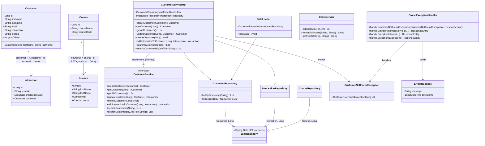

### Class-Entity Diagram: Simple CRM domain

```mermaid
classDiagram
  direction TB

  class Customer {
    +Long id
    +String firstName
    +String lastName
    +String email
    +String contactNo
    +String jobTitle
    +int yearOfBirth
    +Customer(String firstName, String lastName)
  }

  class Interaction {
    +Long id
    +String remarks
    +LocalDate interactionDate
    +Customer customer
  }

  class Course {
    +Long id
    +String courseName
    +String courseCode
  }

  class Student {
    +Long id
    +String firstName
    +String lastName
    +String email
    +Course course
  }

  class CustomerService {
    <<interface>>
    +createCustomer(Customer) Customer
    +getCustomer(Long) Customer
    +getAllCustomers() List
    +updateCustomer(Long, Customer) Customer
    +deleteCustomer(Long) void
    +addInteractionToCustomer(Long, Interaction) Interaction
    +searchCustomers(String) List
    +searchCustomersByJobTitle(String) List
  }

  class CustomerServiceImpl {
    -CustomerRepository customerRepository
    -InteractionRepository interactionRepository
    +createCustomer(Customer) Customer
    +getCustomer(Long) Customer
    +getAllCustomers() List
    +updateCustomer(Long, Customer) Customer
    +deleteCustomer(Long) void
    +addInteractionToCustomer(Long, Interaction) Interaction
    +searchCustomers(String) List
    +searchCustomersByJobTitle(String) List
  }

  class JpaRepository {
    <<Spring Data JPA interface>>
  }

  class CustomerRepository {
    +findByFirstName(String) List
    +findByJobTitleJPQL(String) List
  }

  class InteractionRepository
  class CourseRepository
  class DataLoader {
    -CustomerRepository customerRepository
    +loadData() void
  }
  class DemoService {
    +calculateAge(int, int) int
    +formatFullName(String, String) String
    +getInitials(String, String) String
  }
  class CustomerNotFoundException {
    +CustomerNotFoundException(Long id)
  }
  class ErrorResponse {
    +String message
    +LocalDateTime timestamp
  }
  class GlobalExceptionHandler {
    +handleCustomerNotFoundException(CustomerNotFoundException) ResponseEntity
    +handleMethodArgumentNotValid(...) ResponseEntity
    +handleExceptionInternal(...) ResponseEntity
    +handleException(Exception) ResponseEntity
  }

  CustomerServiceImpl --|> CustomerService : implements (Primary)
  CustomerRepository --|> JpaRepository : Customer, Long
  InteractionRepository --|> JpaRepository : Interaction, Long
  CourseRepository --|> JpaRepository : Course, Long
  CustomerServiceImpl --> CustomerRepository
  CustomerServiceImpl --> InteractionRepository
  CustomerServiceImpl --> CustomerNotFoundException : throws
  DataLoader --> CustomerRepository
  GlobalExceptionHandler --> CustomerNotFoundException : handles
  GlobalExceptionHandler --> ErrorResponse : builds
  Customer "1" --> "*" Interaction : customer (FK customer_id, optional = false)
  Course "1" --> "*" Student : course (FK course_id, LAZY, optional = false)
```