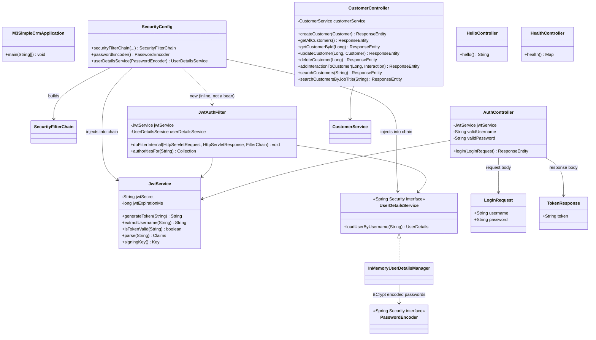

### Class-Entity Diagram: Web Security

```mermaid 
classDiagram
  direction TB

  class M3SimpleCrmApplication {
    +main(String[]) void
  }
  class SecurityConfig {
    +securityFilterChain(...) SecurityFilterChain
    +passwordEncoder() PasswordEncoder
    +userDetailsService(PasswordEncoder) UserDetailsService
  }
  class SecurityFilterChain
  class JwtAuthFilter {
    -JwtService jwtService
    -UserDetailsService userDetailsService
    +doFilterInternal(HttpServletRequest, HttpServletResponse, FilterChain) void
    +authoritiesFor(String) Collection
  }
  class JwtService {
    -String jwtSecret
    -long jwtExpirationMs
    +generateToken(String) String
    +extractUsername(String) String
    +isTokenValid(String) boolean
    +parse(String) Claims
    +signingKey() Key
  }
  class UserDetailsService {
    <<Spring Security interface>>
    +loadUserByUsername(String) UserDetails
  }
  class InMemoryUserDetailsManager
  class PasswordEncoder {
    <<Spring Security interface>>
  }
  class AuthController {
    -JwtService jwtService
    -String validUsername
    -String validPassword
    +login(LoginRequest) ResponseEntity
  }
  class CustomerController {
    -CustomerService customerService
    +createCustomer(Customer) ResponseEntity
    +getAllCustomers() ResponseEntity
    +getCustomerById(Long) ResponseEntity
    +updateCustomer(Long, Customer) ResponseEntity
    +deleteCustomer(Long) ResponseEntity
    +addInteractionToCustomer(Long, Interaction) ResponseEntity
    +searchCustomers(String) ResponseEntity
    +searchCustomersByJobTitle(String) ResponseEntity
  }
  class HelloController {
    +hello() String
  }
  class HealthController {
    +health() Map
  }
  class LoginRequest {
    +String username
    +String password
  }
  class TokenResponse {
    +String token
  }

  SecurityConfig --> JwtService : injects into chain
  SecurityConfig --> UserDetailsService : injects into chain
  SecurityConfig --> SecurityFilterChain : builds
  SecurityConfig ..> JwtAuthFilter : new (inline, not a bean)
  JwtAuthFilter --> JwtService
  JwtAuthFilter --> UserDetailsService
  UserDetailsService <|.. InMemoryUserDetailsManager
  InMemoryUserDetailsManager --> PasswordEncoder : BCrypt encoded passwords
  AuthController --> JwtService
  AuthController --> LoginRequest : request body
  AuthController --> TokenResponse : response body
  CustomerController --> CustomerService
```