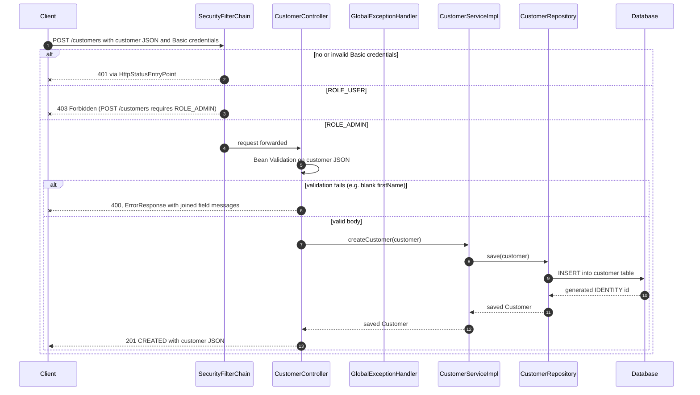

### Create Customer

```mermaid 
sequenceDiagram
  autonumber
  participant C as Client
  participant SC as SecurityFilterChain
  participant CC as CustomerController
  participant GHE as GlobalExceptionHandler
  participant CSI as CustomerServiceImpl
  participant CR as CustomerRepository
  participant DB as Database

  C->>SC: POST /customers with customer JSON and Basic credentials

  alt no or invalid Basic credentials
    SC--xC: 401 via HttpStatusEntryPoint
  else ROLE_USER
    SC--xC: 403 Forbidden (POST /customers requires ROLE_ADMIN)
  else ROLE_ADMIN
    SC->>CC: request forwarded
    CC->>CC: Bean Validation on customer JSON

    alt validation fails (e.g. blank firstName)
      CC--xC: 400, ErrorResponse with joined field messages
    else valid body
      CC->>CSI: createCustomer(customer)
      CSI->>CR: save(customer)
      CR->>DB: INSERT into customer table
      DB-->>CR: generated IDENTITY id
      CR-->>CSI: saved Customer
      CSI-->>CC: saved Customer
      CC-->>C: 201 CREATED with customer JSON
    end
  end
```