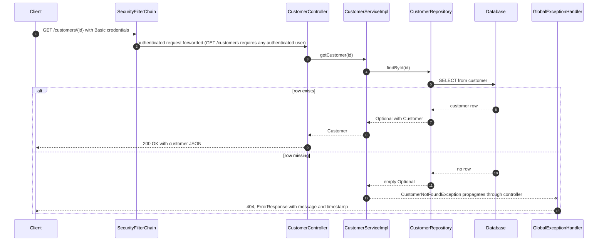

### Find-by 1 Customer

```mermaid
sequenceDiagram
  autonumber
  participant C as Client
  participant SC as SecurityFilterChain
  participant CC as CustomerController
  participant CSI as CustomerServiceImpl
  participant CR as CustomerRepository
  participant DB as Database
  participant GHE as GlobalExceptionHandler

  C->>SC: GET /customers/{id} with Basic credentials
  SC->>CC: authenticated request forwarded (GET /customers requires any authenticated user)
  CC->>CSI: getCustomer(id)
  CSI->>CR: findById(id)
  CR->>DB: SELECT from customer

  alt row exists
    DB-->>CR: customer row
    CR-->>CSI: Optional with Customer
    CSI-->>CC: Customer
    CC-->>C: 200 OK with customer JSON
  else row missing
    DB-->>CR: no row
    CR-->>CSI: empty Optional
    CSI--xGHE: CustomerNotFoundException propagates through controller
    GHE--xC: 404, ErrorResponse with message and timestamp
  end
```