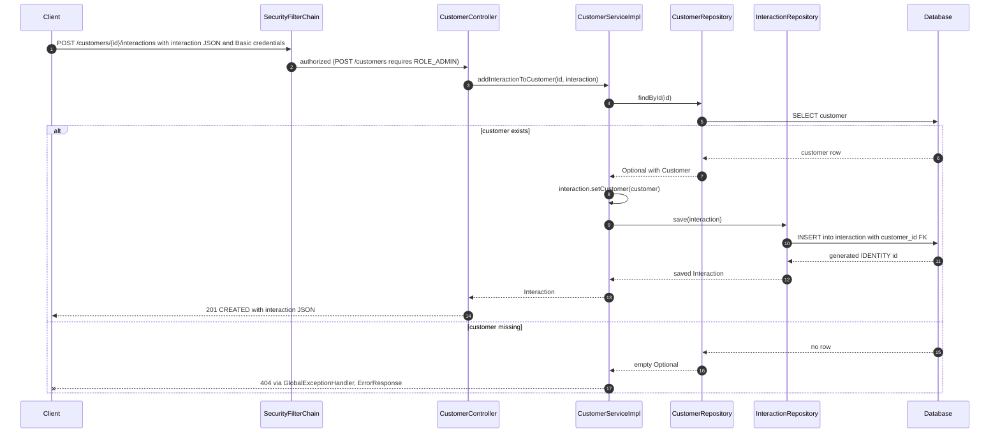

### Add Customer Interaction

```mermaid
sequenceDiagram
  autonumber
  participant C as Client
  participant SC as SecurityFilterChain
  participant CC as CustomerController
  participant CSI as CustomerServiceImpl
  participant CR as CustomerRepository
  participant IR as InteractionRepository
  participant DB as Database

  C->>SC: POST /customers/{id}/interactions with interaction JSON and Basic credentials
  SC->>CC: authorized (POST /customers requires ROLE_ADMIN)
  CC->>CSI: addInteractionToCustomer(id, interaction)
  CSI->>CR: findById(id)
  CR->>DB: SELECT customer

  alt customer exists
    DB-->>CR: customer row
    CR-->>CSI: Optional with Customer
    CSI->>CSI: interaction.setCustomer(customer)
    CSI->>IR: save(interaction)
    IR->>DB: INSERT into interaction with customer_id FK
    DB-->>IR: generated IDENTITY id
    IR-->>CSI: saved Interaction
    CSI-->>CC: Interaction
    CC-->>C: 201 CREATED with interaction JSON
  else customer missing
    DB-->>CR: no row
    CR-->>CSI: empty Optional
    CSI--xC: 404 via GlobalExceptionHandler, ErrorResponse
  end
```