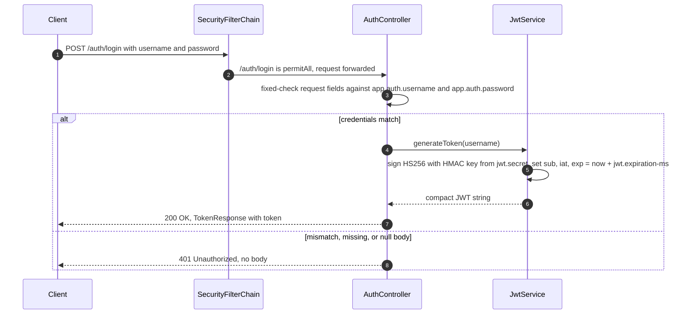

### Login

```mermaid
sequenceDiagram
  autonumber
  participant C as Client
  participant SC as SecurityFilterChain
  participant AC as AuthController
  participant JS as JwtService

  C->>SC: POST /auth/login with username and password
  SC->>AC: /auth/login is permitAll, request forwarded
  AC->>AC: fixed-check request fields against app.auth.username and app.auth.password

  alt credentials match
    AC->>JS: generateToken(username)
    JS->>JS: sign HS256 with HMAC key from jwt.secret, set sub, iat, exp = now + jwt.expiration-ms
    JS-->>AC: compact JWT string
    AC-->>C: 200 OK, TokenResponse with token
  else mismatch, missing, or null body
    AC-->>C: 401 Unauthorized, no body
  end
```