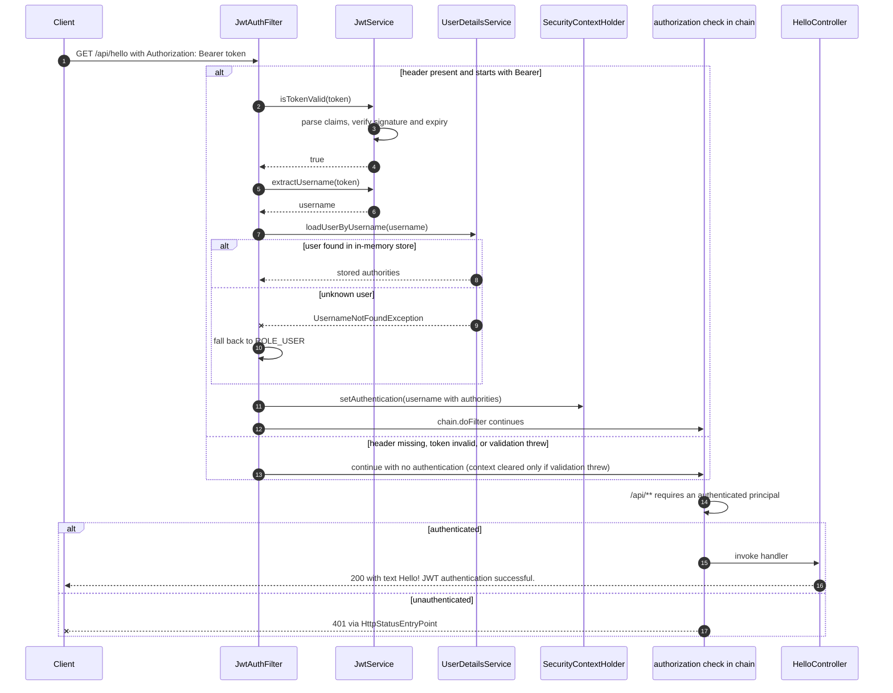

### JWT Protected Access Test

```mermaid
sequenceDiagram
  autonumber
  participant C as Client
  participant JAF as JwtAuthFilter
  participant JS as JwtService
  participant UDS as UserDetailsService
  participant SCH as SecurityContextHolder
  participant AF as authorization check in chain
  participant HLC as HelloController

  C->>JAF: GET /api/hello with Authorization: Bearer token

  alt header present and starts with Bearer
    JAF->>JS: isTokenValid(token)
    JS->>JS: parse claims, verify signature and expiry
    JS-->>JAF: true
    JAF->>JS: extractUsername(token)
    JS-->>JAF: username
    JAF->>UDS: loadUserByUsername(username)
    alt user found in in-memory store
      UDS-->>JAF: stored authorities
    else unknown user
      UDS--xJAF: UsernameNotFoundException
      JAF->>JAF: fall back to ROLE_USER
    end
    JAF->>SCH: setAuthentication(username with authorities)
    JAF->>AF: chain.doFilter continues
  else header missing, token invalid, or validation threw
    JAF->>AF: continue with no authentication (context cleared only if validation threw)
  end

  AF->>AF: /api/** requires an authenticated principal
  alt authenticated
    AF->>HLC: invoke handler
    HLC-->>C: 200 with text Hello! JWT authentication successful.
  else unauthenticated
    AF--xC: 401 via HttpStatusEntryPoint
  end
```